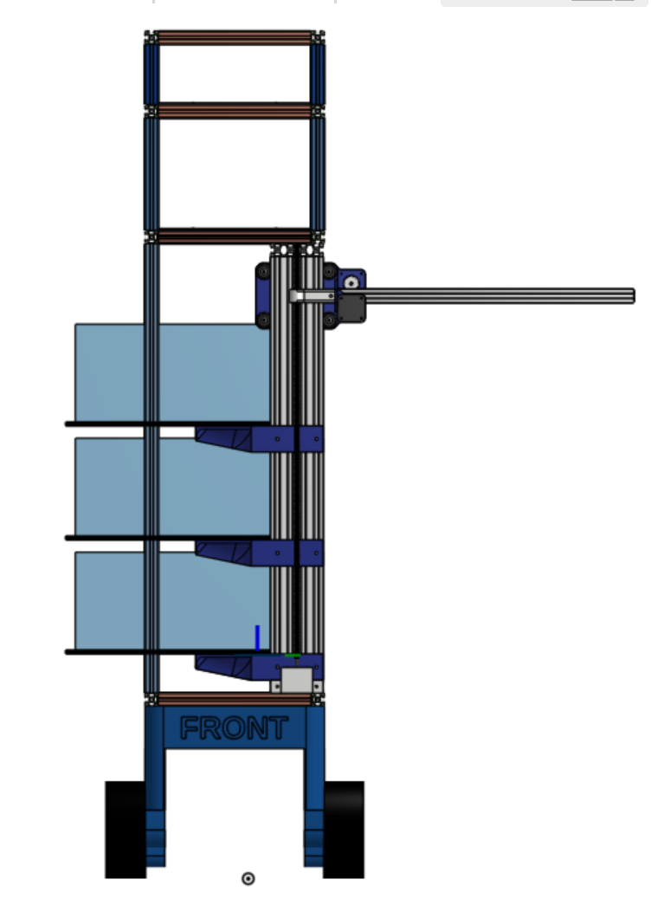

# Dimensions

## General Part Table

| Part | Dimensions (mm) |
| --- | --- |
| Standard project box | 250x380x150 |
| Non-base robot footprint |  |

## Allocated subsystem (not subteam!) space

| Subsystem | Footprint (w x h x d) | Location | Colour in Onshape |
| --- | --- | --- | --- |
| Interaction | 275 x  300 x 110 | Top | Yellow |
| Dispensing | 275 x 300 x 170 | Second highest | Red |
| Box storage | 275 x 300 x 690 | Second lowest | Orange |
| Drive/navigation | See robot base footprint | Robot base (lowest) | Blue |
| Other hardware | N/A | Everywhere | Grey |

## Weight

Ubiquity magni payload: 100kg

For safety, limit to 66kg

8080mm = 8.08m of 20-2020 extrusion for main frame (based on BOM); [0.4kg/m](https://www.aluminium-profile.co.uk/20x20-aluminium-profile-kjn992888)

| Part | Mass | COM (wrt origin) |
| --- | --- | --- |
| Base | 13.5kg | 0mm x 0mm x 132.5mm |
| Gantry | 5kg | -13.6mm x 74.56mm x 630mm |
| Frame | 2.4kg | 0mm x -20mm x 783mm |
| Total | 20.9 | -3mm x 16mm x 326mm |

Remaining payload: 66.6kg - (5kg + 2.4kg) = 58.8kg

The rough COM is slightly to the right; if need be, we can mount weights to the left side of the frame, underneath the lowest shelf