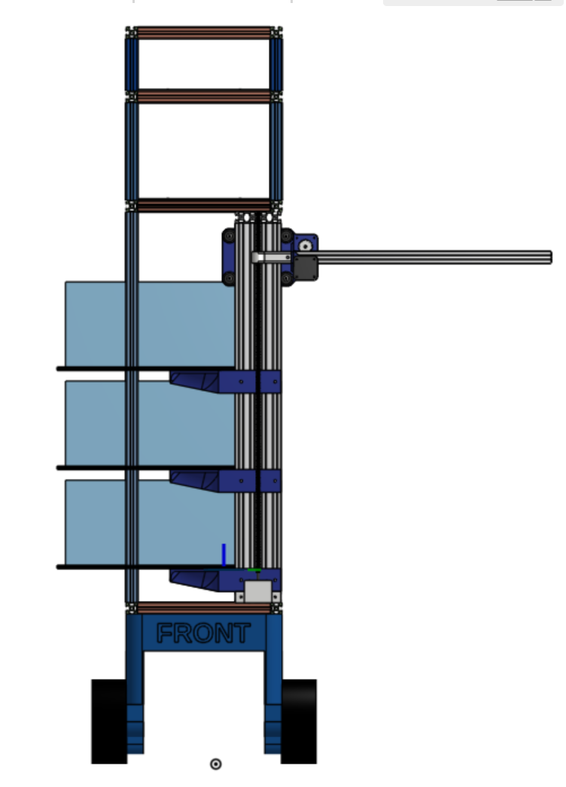

# Extrusion Frame

- EE Stores: “No stock”
    - We’d have to go through approved suppliers to order
- 1st floor technicians (May): We don’t have any spare
- Success! Met with GTA, we get extrusion via her. [TA Meeting R.E. Manufacturing](https://www.notion.so/TA-Meeting-R-E-Manufacturing-47cd3c4632114704bcf6aec03b95d0d1?pvs=21)

## Extrusion BOM V1

### Main frame

| Profile | Amount | Length | Notes |
| --- | --- | --- | --- |
| 20-2020 | 12 | 235mm | X |
| 20-2020 | 8 | 355mm | Y |
| 20-2020 | 2 | 690mm | Z |
| 20-2020 | 4 | 175mm | Dispensing |
| 20-2020 | 4 | 95mm | Interaction |

### Gantry

| Profile | Amount | Length |
| --- | --- | --- |
| 2080 | 2x | 380mm |
| 2080 | 2x | 650mm |

## Extrusion BOM V2

### Main frame (5359mm total)

| Profile | Amount | Length | Notes | Drilling/tapping |
| --- | --- | --- | --- | --- |
| 20-2020 | 5 | 235mm | X | 1x Both ends tapped
4x Single end tapped |
| 20-2020 | 4 | 352mm | Y1 | 4x Drilled (10mm from both ends)
2x (of the 4 above) also drilled 176mm from end (in middle), perpendicular to end holes |
| 20-2020 | 2 | 312mm | Y2 | 1x Both ends tapped
1x None |
| 20-2020 | 2 | 883mm | Z | 2x Both ends tapped, and drilled 183mm from 1 end |
| 20-2020 | 2 | 193mm | Z2 | 2x One end tapped, and drilled 10mm from the other end |

### Other Components

| 2020 brackets | 12 |  | 3D printed |  |
| --- | --- | --- | --- | --- |
| Screws (for tapped ends) | 14 |  |  |  |

# BOM V3 (Final)

| Profile | Amount | Length | Notes | Drilling/tapping |
| --- | --- | --- | --- | --- |
| 20-2020 | 5(-1) | 235mm | X | (1x Both ends tapped)
4x Single end tapped |
| 20-2020 | 4 | 377mm | Y1 | 4x Drilled (10mm from one end, 35mm from other end)
2x (of the 4 above) also drilled 176mm from first end, perpendicular to end holes |
| 20-2020 | 2(-1) | 312mm | Y2 | 1x Both ends tapped
1x None |
| 20-2020 | 2 | 883mm | Z | 2x Both ends tapped, and drilled 183mm from 1 end |
| 20-2020 | 2 | 193mm | Z2 | 2x One end tapped, and drilled 10mm from the other end |

